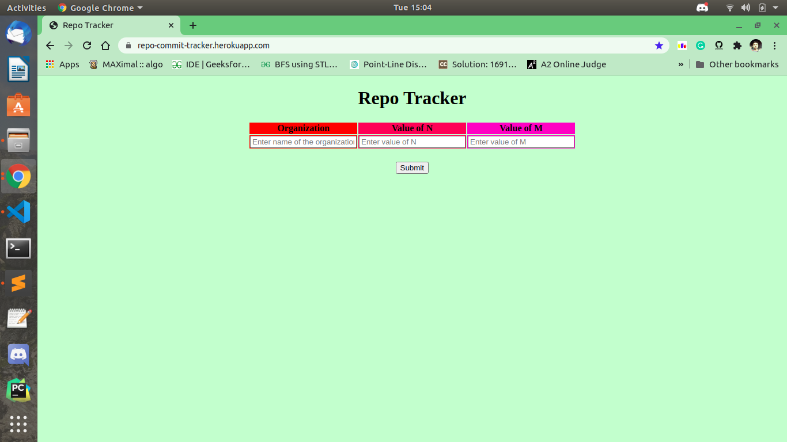
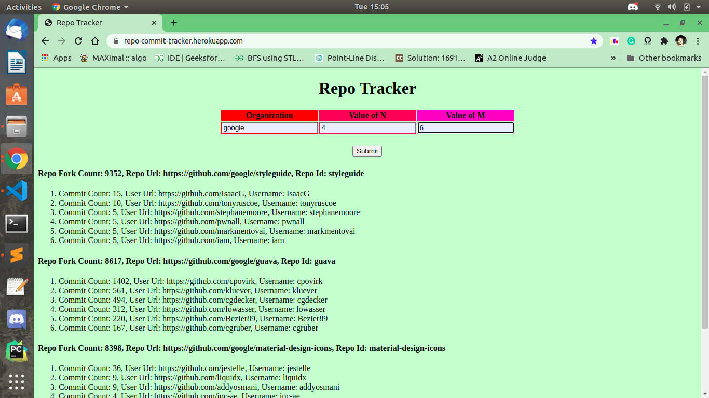

# Repo-Tracker
Developed a web application based on Flask Framework and Github API. It gives most popular repositories of a given organization based on forks count and for each such repo it gives top committees and their commit count and user details. Some Screenshots of the RepoTracker is below,
 

